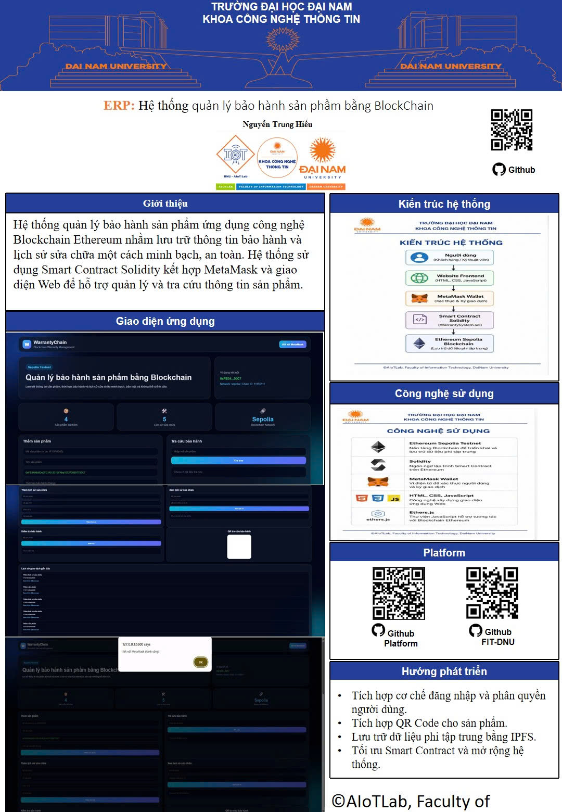
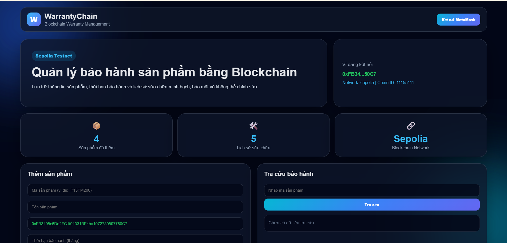
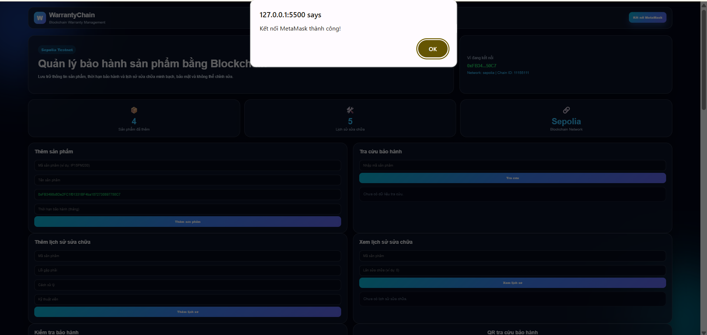
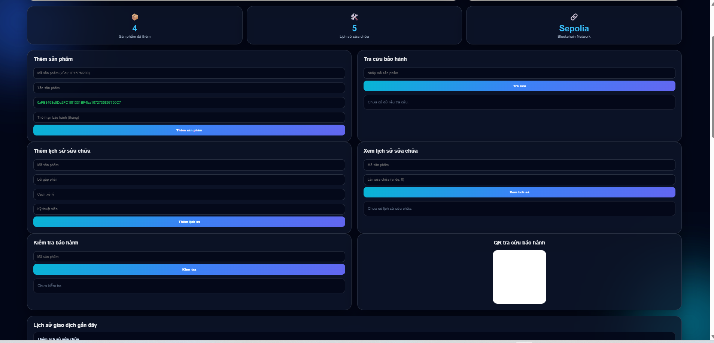
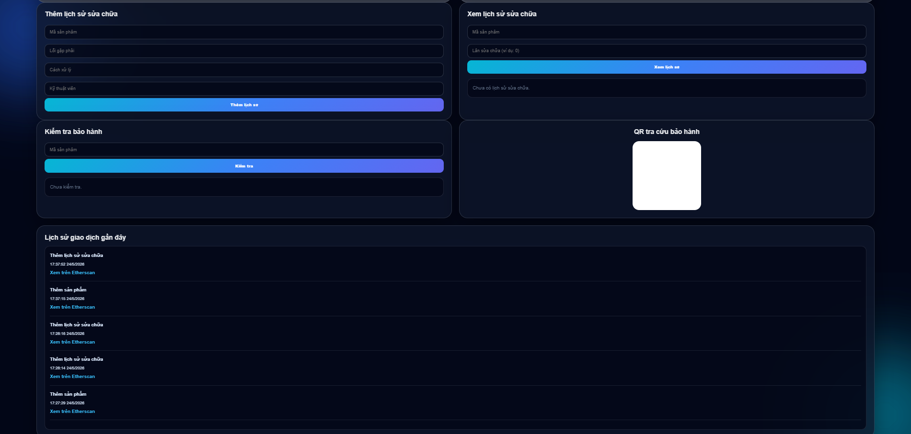

# 🔗 Blockchain Warranty System

<div align="center">

# 🛡️ HỆ THỐNG QUẢN LÝ BẢO HÀNH SẢN PHẨM

## Dựa Trên Công Nghệ Blockchain Ethereum

### 👨‍🎓 Nguyễn Trung Hiếu

### 🏫 Đại Học Đại Nam

### 👨‍🏫 Giảng viên hướng dẫn: ThS. Trần Đăng Công


</div>

<p align="center">
  
</p>

<p align="center">
<b>Blockchain Warranty Management System on Ethereum Sepolia Testnet</b>
</p>

---

# 📖 Giới Thiệu

Blockchain Warranty System là ứng dụng phi tập trung (DApp) hỗ trợ quản lý bảo hành sản phẩm bằng công nghệ Blockchain Ethereum.

Hệ thống cho phép lưu trữ thông tin sản phẩm, thời gian bảo hành và lịch sử sửa chữa thông qua Smart Contract Solidity nhằm đảm bảo tính minh bạch, bảo mật và khả năng truy xuất dữ liệu.

---

# 🎯 Mục Tiêu Đề Tài

✅ Số hóa quy trình bảo hành sản phẩm

✅ Lưu trữ dữ liệu trên Blockchain

✅ Tăng tính minh bạch và độ tin cậy

✅ Hỗ trợ truy xuất lịch sử sửa chữa

✅ Nghiên cứu và ứng dụng công nghệ Blockchain vào thực tiễn

---

# ⚙️ Công Nghệ Sử Dụng

| Công nghệ     | Vai trò                    |
| ------------- | -------------------------- |
| 🔗 Ethereum   | Blockchain Platform        |
| 📜 Solidity   | Smart Contract Development |
| 🦊 MetaMask   | Wallet Integration         |
| 🌐 Sepolia    | Ethereum Testnet           |
| 💻 HTML / CSS | User Interface             |
| 🚀 JavaScript | Application Logic          |

---

# 🏗️ Kiến Trúc Hệ Thống

```text
Người dùng
     │
     ▼
🌐 Frontend Website
     │
     ▼
🦊 MetaMask Wallet
     │
     ▼
📜 Smart Contract
     │
     ▼
🔗 Ethereum Sepolia Blockchain
```

---

# 📜 Smart Contract Information

| Thông tin          | Giá trị                  |
| ------------------ | ------------------------ |
| Blockchain Network | Ethereum Sepolia Testnet |
| Smart Contract     | WarrantySystem.sol       |
| Wallet             | MetaMask                 |
| Ngôn ngữ           | Solidity                 |
| Frontend           | HTML, CSS, JavaScript    |

### Các Chức Năng Chính

* registerProduct()
* updateWarranty()
* addRepairHistory()
* getProductInfo()

> Có thể bổ sung Contract Address sau khi triển khai chính thức trên Ethereum Sepolia.

---

# ✨ Chức Năng Chính

## 👨‍💼 Quản Trị Viên

* ➕ Thêm sản phẩm mới
* 🔧 Cập nhật lịch sử sửa chữa
* 📋 Quản lý thông tin bảo hành

## 👤 Người Dùng

* 🔍 Tra cứu sản phẩm
* 📅 Kiểm tra thời hạn bảo hành
* 📖 Xem lịch sử sửa chữa
* 🔗 Theo dõi giao dịch Blockchain

---

# 📸 Hình Ảnh Hệ Thống

## 🏠 Giao Diện Trang Chủ

Giao diện chính của hệ thống hiển thị thống kê sản phẩm, tình trạng bảo hành và các chức năng quản lý.



---

## 🦊 Kết Nối Ví MetaMask

Người dùng kết nối ví MetaMask để xác thực và thực hiện các giao dịch trên Blockchain Ethereum Sepolia.



---

## 🔧 Quản Lý Và Tra Cứu Bảo Hành

Cho phép thêm sản phẩm mới, tra cứu thông tin bảo hành và quản lý dữ liệu sản phẩm.



---

## 📜 Lịch Sử Giao Dịch Blockchain

Hiển thị các giao dịch đã thực hiện trên hệ thống như thêm sản phẩm và cập nhật lịch sử sửa chữa.



---

# 🎥 Demo & Truy Cập Nhanh

## Video Demo

Thêm liên kết video demo dự án tại đây:

https://youtube.com/

## QR Code Repository


---

# 📊 Thống Kê Dự Án

* 01 Smart Contract Solidity
* 04 Giao diện chức năng chính
* Kết nối MetaMask Wallet
* Triển khai trên Ethereum Sepolia Testnet
* Hệ thống quản lý bảo hành phi tập trung
* Hỗ trợ truy xuất lịch sử bảo hành minh bạch

---

# 📂 Cấu Trúc Dự Án

```text
Blockchain-Warranty-System
│
├── WarrantySystem.sol
├── app.js
├── index.html
├── style.css
│
├── images
│   ├── poster.png
│   ├── qrcode.png
│   ├── home.png
│   ├── metamask.png
│   ├── warranty.png
│   └── history.png
│
└── README.md
```

---

# 🚀 Hướng Dẫn Chạy Dự Án

### 1️⃣ Yêu cầu

* Trình duyệt Chrome hoặc Microsoft Edge
* MetaMask Wallet
* Kết nối mạng Ethereum Sepolia Testnet

### 2️⃣ Khởi chạy

* Tải source code từ GitHub
* Mở file `index.html`
* Kết nối ví MetaMask
* Chọn mạng Sepolia Testnet
* Sử dụng các chức năng của hệ thống

---

# 🚀 Kết Quả Đạt Được

✅ Xây dựng thành công Smart Contract bằng Solidity

✅ Kết nối MetaMask với Ethereum Sepolia

✅ Quản lý thông tin bảo hành trên Blockchain

✅ Lưu trữ lịch sử sửa chữa minh bạch

✅ Tra cứu thông tin sản phẩm theo thời gian thực

✅ Theo dõi giao dịch Blockchain thông qua Explorer

---

# 🔮 Hướng Phát Triển

* 📱 Xây dựng ứng dụng Mobile
* 🔳 Tích hợp QR Code sản phẩm
* ☁️ Tích hợp IPFS lưu trữ tài liệu bảo hành
* 👥 Phân quyền nhà sản xuất và khách hàng
* 📊 Bổ sung thống kê và báo cáo dữ liệu
* 🔗 Triển khai trên Ethereum Mainnet

---

# 🏆 Kết Luận

Dự án Blockchain Warranty System đã xây dựng thành công hệ thống quản lý bảo hành sản phẩm dựa trên công nghệ Blockchain Ethereum.

Thông qua Smart Contract Solidity và MetaMask Wallet, hệ thống cho phép lưu trữ và quản lý thông tin bảo hành minh bạch, an toàn và có khả năng truy xuất dữ liệu hiệu quả.

---

# 🔗 GitHub Repository

https://github.com/mongkobiripface-ai/Blockchain-Warranty-System

---

# 👨‍🎓 Tác Giả

**Nguyễn Trung Hiếu**

🎓 Sinh viên ngành Công Nghệ Thông Tin

🏫 Đại Học Đại Nam

👨‍🏫 Giảng viên hướng dẫn: ThS. Trần Đăng Công

📅 Năm học 2025 – 2026

---

⭐ Dự án được thực hiện phục vụ mục đích học tập, nghiên cứu và ứng dụng công nghệ Blockchain trong quản lý bảo hành sản phẩm.
